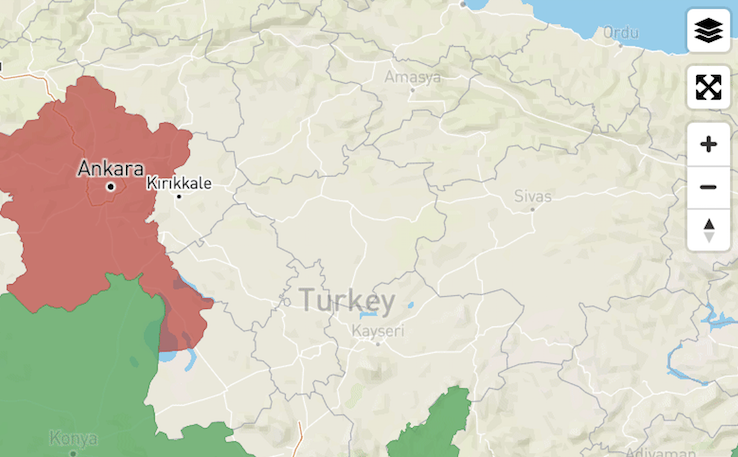
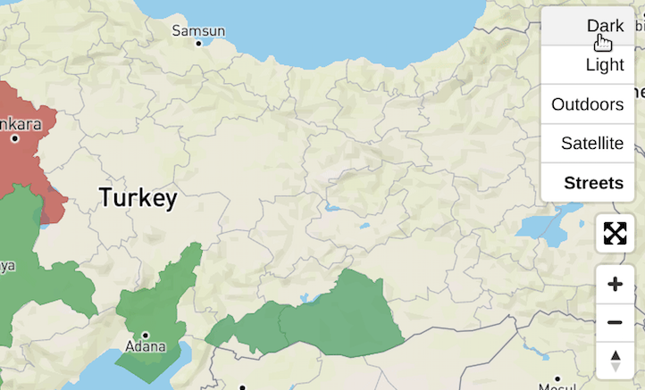

# Mapbox GL JS Style Switcher

Adds a style switcher to `mapbox-gl`

## Installation:

```bash
npm i mapbox-gl-style-switcher --save
```

## Usage:

```ts
import { MapboxStyleSwitcherControl } from "mapbox-gl-style-switcher";
import { Map as MapboxMap } from "mapbox-gl";

import "@mapbox-gl-style-switcher/styles";

const map = new MapboxMap();
map.addControl(new MapboxStyleSwitcherControl());
```

## Options:
If you want to supply your own list of styles, pass them in the constructor.

```ts
import { MapboxStyleDefinition, MapboxStyleSwitcherControl } from "mapbox-gl-style-switcher";

const styles: MapboxStyleDefinition[] = [
    {
        title: "Dark",
        uri:"mapbox://styles/mapbox/dark-v9"
    },
    {
        title: "Light",
        uri:"mapbox://styles/mapbox/light-v9"
    }
];

map.addControl(new MapboxStyleSwitcherControl(styles));
```

## Images



